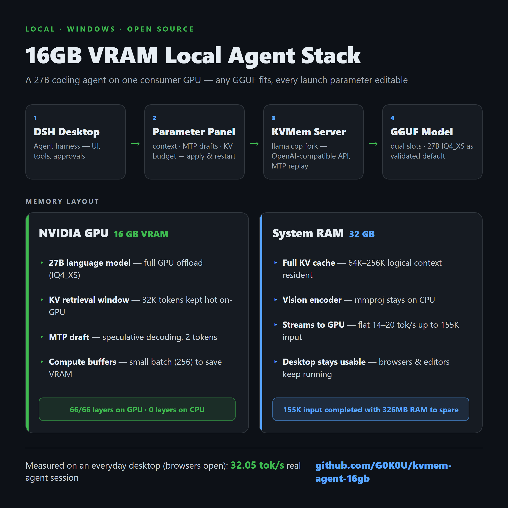
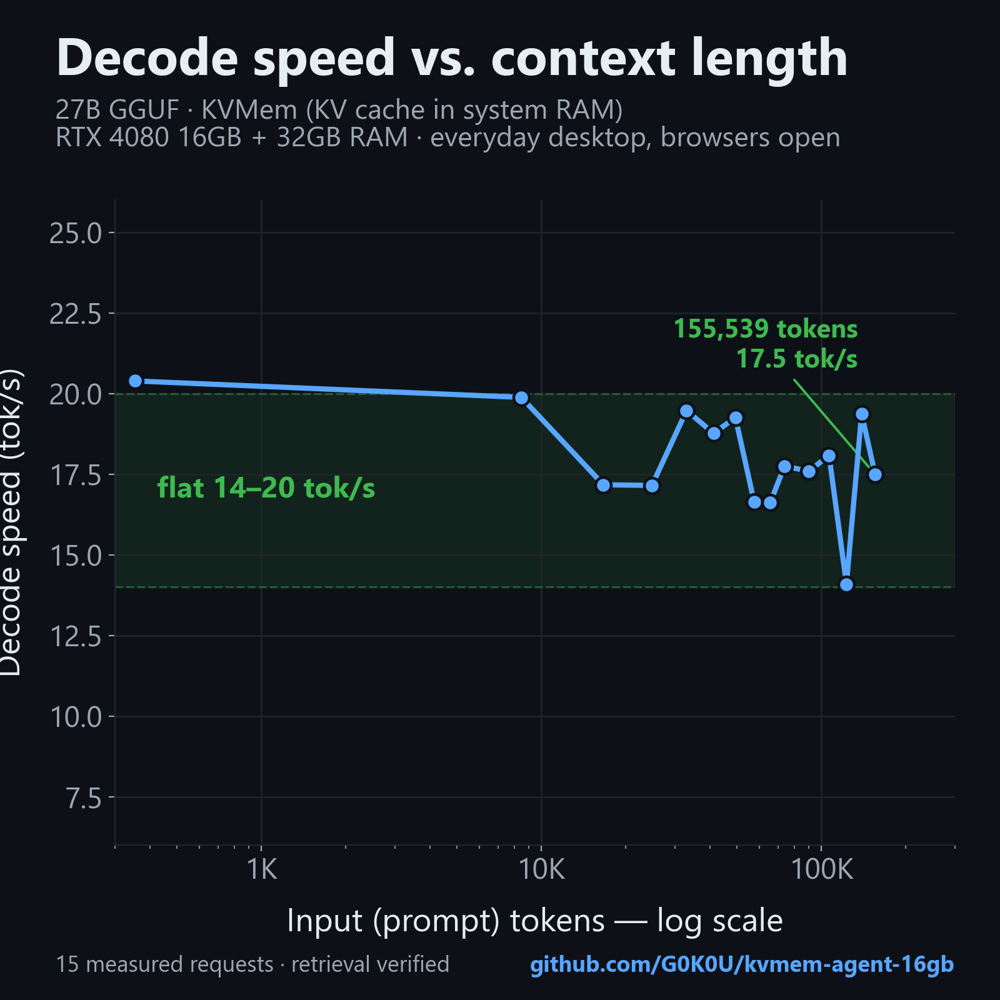

[**English**](README.md) | [简体中文](README.zh-CN.md)

<p align="center">
  
</p>

# 27B Local Coding Agent on 16GB VRAM

> A deployable, reproducible Windows local-agent stack for the **16GB-VRAM / 32GB-RAM consumer hardware class**.

**One repo. One setup. Fully local.**

**Deploying on another 16GB PC, or troubleshooting OOM? Start with the [complete deployment guide](docs/DEPLOYMENT.md) and [Codex handoff instructions](docs/CODEX-DEPLOY.en.md).** Includes existing-DSH integration with backups, five clearly defined model profiles, low-budget startup presets, GPU preflight and the ComfyUI image companion. Bonsai requires the separate custom runtime described in [its prerequisites](docs/BONSAI.en.md); this is not an automatic four-engine installer.

> **Default daily model: GSQ (`iq3`) — general-purpose + multimodal.** It uses the standard KVMem path with the F16 vision projector and is the default model downloaded/configured by this repo. For maximum speed and an explicitly **Jailbreak / Flash / text-only** profile, use **[Bonsai 2 CRACK PQ2](docs/CRACK-FLAGSHIP.md)**: 100+ tok/s daily use with 262144 context on RTX 4080 16GB (98.9–99.1 tok/s strict single-shot baseline). CRACK requires the custom NInfer runtime.

[Download the v1.3.0 deployment archive and SHA256](https://github.com/G0K0U/kvmem-agent-16gb/releases/tag/v1.3.0) (no weights or private configuration).

**Optional local image generation:** [Qwen-Image 2.1 companion setup](addons/qwen-image21/README.md) works alongside this **KVMem + DSH configuration** (also referred to as KVMan). It adds official prompt rewriting, text-to-image and reference-image editing using your existing Q4_K_M weights and local ComfyUI. The controller unloads the chat model before generation and reloads it afterward, allowing both capabilities to share a 16GB GPU sequentially. See the guide for prerequisites and tested limits.

Run a 27B coding agent on a single consumer GPU:

**DSH Desktop → Parameter Panel → KVMem (llama.cpp fork) → GGUF**

The language model stays fully GPU-offloaded while the long-context KV cache lives in system RAM, so a 16GB GPU remains useful for long-context coding and agent work. The two model slots accept **any GGUF**, and every launch parameter — context size, MTP draft count, KV budget — is editable from the panel.

**Validated on**

| | |
|---|---|
| **GPU** | RTX 4080 — 16GB VRAM |
| **System RAM** | 32GB |
| **Default model** | GSQ — Qwen3.8-27B-GSQ-RCO IQ3_S MTP + F16 vision projector |
| **Daily preset** | 64K context / MTP2 |
| **Platform** | Windows |

## Measured on a real desktop

| | Result |
|---|---:|
| Real 10-call coding-agent session | **32.05 tok/s weighted throughput** |
| Long-context decode | **14–20 tok/s from ~20K to 155K input** |
| Practical daily context preset | **64K** |
| MTP speculative decoding | **Draft 2, zero replay errors in the measured session** |
| Flagship: Bonsai 2 CRACK PQ2 (NInfer runtime) | **100+ tok/s daily, 262144 context** |

These numbers were measured on an everyday desktop, with browsers, editors and chat applications left open in the background — not on an isolated benchmark machine. The flagship row is the [Bonsai 2 CRACK deployment](docs/CRACK-FLAGSHIP.md): 98.9–99.1 tok/s single-shot strict baseline at deployment, 100+ tok/s sustained in daily use on both RTX 4080 machines; 262144 context allocates with ~1.61 GiB VRAM free.

> **32.05 tok/s is session-weighted throughput, not a claim that 155K context decodes at 32 tok/s.** The session's actual peak context was about 27K tokens. Method, numbers and limits: [case study](docs/CASE-STUDY.md).

<p align="center">
  
</p>

## Quick start

Requires Windows x64, an NVIDIA driver matching the pinned CUDA runtime, **16GB VRAM + 32GB RAM**, Node.js 24 (original environment 24.19.0), PowerShell, Git and curl. The default GSQ model is about 11.29 GiB and the vision encoder about 0.93GB. Everyday background software (browser, editors, chat) can stay open while the model runs — the numbers above were measured that way; close GPU-heavy workloads such as ComfyUI or games.

**Three commands. The only interactive step is the DSH Desktop installer.**

```powershell
.\scripts\Download.ps1 -Models
```

Fetches the KVMem runtime, the DSH Desktop installer, the model and the vision encoder. Every file is SHA256-checked against pinned hashes; an interrupted download leaves a `.part` that restarts next time.

Run the DSH Desktop installer from `downloads\` once — this is the only manual step.

```powershell
.\scripts\Deploy.ps1
```

Extracts the KVMem runtime, locates the DSH Desktop install (in order: the `-DesktopRoot` parameter → an existing `local/launch.json` → the registry → standard install paths → Start Menu shortcuts; pass `-DesktopRoot` if it lives somewhere custom), generates the dedicated config in the Git-ignored `local/dsh-home`, installs the panel plugin through the desktop CLI, starts the stack and waits until the model API reports healthy (first model load can take a few minutes).

Then open DSH Desktop and select the included **64K / MTP2** preset.

> Model weights and upstream binaries are downloaded from their original sources and verified against pinned hashes in [assets.json](config/assets.json). This repository does not redistribute them.

<details>
<summary><strong>Manual setup (alternative to Deploy.ps1)</strong></summary>

```powershell
.\scripts\Configure.ps1 `
  -DesktopRoot 'D:\Apps\DSH Desktop Beta' `
  -RuntimeBin 'D:\Models\kvmem\bin' `
  -ModelsDir "$PWD\downloads" `
  -NodeExe 'node'
```

`DesktopRoot` must contain `DSH Desktop Beta.exe` and `resources/app/lib/desktop-cli.js` (find the install directory via the shortcut's "Open file location"). The script calls the desktop-only CLI's `plugin --profile desktop add ... --ignore-scripts`; do not substitute a different global dsh. Data goes into the Git-ignored `local/dsh-home`, working directory `local/workspace`; an existing DSH user directory is never touched, and re-runs refuse to overwrite. If plugin installation is interrupted, set `DSH_HOME` to this dedicated directory manually and retry the desktop-cli plugin command. Fully exit other DSH Desktop instances and anything occupying ports 18200/43189, then run `.\scripts\Start.ps1` and `.\scripts\Health.ps1`.

</details>

## Why this exists

16GB VRAM + 32GB system RAM is a practical consumer hardware target for local AI, but fitting the model is only part of the problem. Long-context agent workloads also need memory for the KV cache, tools, runtime processes and the rest of the desktop.

KVMem changes that memory split:

**GPU (16GB)**

- 27B language model, fully offloaded
- hot KV retrieval window
- CUDA inference

**System RAM (32GB)**

- full historical KV cache
- long-context state
- CPU-side vision encoder in the validated configuration

The result is not a new inference engine. This repository integrates existing open-source components into a **reproducible Windows local-agent system**: deployment scripts, parameter management, pinned versions, validation evidence and documented failure boundaries.

## Architecture & pinned versions

```text
DSH Desktop → local parameter panel manages the model process
           → OpenAI-compatible API 127.0.0.1:18200/v1
           → KVMem CUDA → GGUF (language model on GPU / vision encoder on CPU)
```

| Component | Pinned version / source |
|---|---|
| GSQ (`iq3`, default model) | [Qwen3.8-27B-GSQ-RCO IQ3_S MTP](https://huggingface.co/ISTA-DASLab/Qwen3.8-27B-GSQ-RCO-GGUF), revision `d562806dbafae37109975e970aae91b43e73b440` |
| KVMem | [v0.16.0-rc2](https://github.com/kvmem/kvmem-llama.cpp/releases/tag/v0.16.0-rc2), Windows CUDA 13.2.86 |
| DSH Desktop | [2.0.12-beta.1](https://github.com/anywhere-labs/dsh-desktop/releases/tag/v2.0.12-beta.1), community desktop client |
| DeepSeek Harness | `0.1.6-alpha.2`, bundled with the desktop build |
| Parameter panel | [Lbunc/dsh-local-llm-controller](https://github.com/Lbunc/dsh-local-llm-controller), local KVMem adaptation `2.0.4-kvmem.1` based on `87f23f187aad397f0040d8d192c6d9ad83320f85` |

These are pinned versions, not a tracker of latest. Download URLs and SHA256 live in [assets.json](config/assets.json). The repo distributes no model weights and no upstream binaries.

## What is generic vs. what is pinned

| Generic — works with other models | Pinned in this repo |
|---|---|
| Two model slots (A/B); each slot points at any folder of GGUF files, `mmproj` auto-detected, one model process at a time | `assets.json` pins the GSQ IQ3_S MTP model + F16 mmproj so `Download.ps1` is one command with SHA256 checks |
| Eight editable launch-parameter groups (2 slots × text/vision × fast/long) | `settings.template.json` presets were tuned on the 27B / 66-layer model: 64K, MTP2, q5_0 KV, budget 32K |
| Model display name derives from the GGUF filename and can be renamed on the models page | The measured numbers were taken with the QQZ model only |
| `serverExe` is configurable (`llama-kvmem-server.exe`; `llama-server` on Linux/macOS) | DSH Desktop and DeepSeek Harness versions are pinned |

Apply-time validation in the panel enforces an envelope: context ∈ {64K, 128K, 192K, 256K}; `--kvmem-budget` ∈ {8K … 48K} in 8K steps; `--kvmem-gen-reserve` ∈ {4K, 8K, 16K}; budget + reserve ≤ context; MTP drafts 1–4; `-ngl` ≥ 66 (full GPU offload). That envelope matches 27B-class MTP GGUFs on 16GB VRAM. Other models load through the same slots, but anything outside this envelope is outside what this repo has tested, and the MTP presets assume an MTP-enabled GGUF.

## Daily use & parameter panel

Open the Local LLM Controller in DSH settings. Default slot A is **GSQ (`iq3`)**, vision mode, fast preset = **64K / MTP2**, with the CPU vision encoder kept in this mode. Pick a context step, MTP draft count and KV budget, then click "Apply & restart"; wait for the backend to become healthy again, confirm the context size synced in the model list, and only then start a new task. Finish any running agent request first.

| Parameter | Default | Meaning |
|---|---:|---|
| `-c` | 65536 | Logical context ceiling, not tokens actually in use |
| `--kvmem-budget` | 32768 | KVMem token retrieval budget, not MB |
| `--kvmem-gen-reserve` | 8192 | Generation reserve |
| `--spec-draft-n-max` | 2 | MTP draft count (not the negative value -2) |
| `-ctk` / `-ctv` | q5_0 | KV quantization |
| `-b` | 256 | batch |
| `-ngl` | 999 | Request full GPU offload |

The config also enables `draft-mtp`, MTP replay, and a thinking budget of 4096. DSH's High maps to **xhigh**, which the model template accepts, preventing `Unexpected reasoning effort high`. low/medium pass through unchanged. The standalone launch parameter medium is only a default; DSH requests may override it.

For a coding acceptance check, use "create a single-file HTML in the working directory with an SVG animation of a pelican riding a bicycle". The default Workspace Write permission keeps DSH's approval behavior; choose the permission mode you need in the UI. This repo does not auto-approve on your behalf.

To shut down: stop tasks, stop the model in the panel, then exit the desktop normally. Backing up `local/dsh-home` preserves settings and sessions, but never commit it to GitHub.

## Model guide

The repository exposes five named profiles. One model runs at a time. The three GGUF profiles use the standard KVMem slot and can use the shared F16 vision projector; Bonsai-family `.ninfer` artifacts use the custom NInfer runtime and are text-only in DSH.

| ID | Actual model | Backend | Status / intended use |
|---|---|---|---|
| `iq3` | **Qwen3.8-27B-GSQ-RCO IQ3_S MTP** | KVMem | **Default — general-purpose + multimodal.** Recommended daily profile; shared F16 vision projector; author field figure ~50 tok/s. |
| `qqz` | **Qwen3.8-27B-ZeroRefusal IQ4_XS V3 Final MTP** | KVMem | Balanced KVMem alternative. This remains the historical case-study / long-context measurement baseline. |
| `heretic` | **Qwen3.8-27B-Heretic-Ara IQ4_XS 3.0 MTP** | KVMem | Alternative 16GB GGUF profile; supports the same KVMem multimodal path when the projector is enabled. |
| `bonsai` | **Bonsai2-PQ2-MTP.ninfer** | NInfer | Original Bonsai NInfer profile / compatibility fallback; **text-only** in DSH. |
| `crack` | **Bonsai2-CRACK-PQ2.ninfer** | NInfer | **Jailbreak / Flash / text-only flagship.** 100+ tok/s daily use, 262144 context; custom Windows/Ada NInfer runtime required. |

`config/chat-models.json` carries the same role and modality metadata in machine-readable form. The reproducible default path now downloads/configures `iq3`; `.\scripts\Download-ChatModel.ps1 -Model iq3 -Vision` does the same explicitly. CRACK remains a separately prepared NInfer artifact/runtime path; see the [flagship document](docs/CRACK-FLAGSHIP.md).

The ~50 tok/s GSQ number is the author's field figure under everyday-desktop conditions, not a controlled protocol. The 32.05 tok/s session-weighted and 20K–155K long-context figures elsewhere in this README are retained as **QQZ historical evidence**, not re-labelled as GSQ results.

### Third-party community validation

A separate community report on **RTX 4080 16GB + 32GB RAM / Windows 11 / KVMem rc3** tested the same GSQ `IQ3_S MTP` model and extends the evidence beyond this repository's own measurements: [kvmem/kvmem-llama.cpp#47](https://github.com/kvmem/kvmem-llama.cpp/issues/47).

Reported results include:

- **52.6 tok/s** decode on a ~60K-token retrieval prompt, with the planted mid-context value retrieved correctly.
- **54.6–59.1 tok/s** across all 9 K/V quantization combinations tested at ~32K tokens, with successful cache reuse and retrieval.
- A **100,084-token** retrieval run within a 128K context at **56.5 tok/s**, with the planted value retrieved correctly.
- Successful multimodal inference with the projector kept on CPU; that report used the smaller **Q5_K-MIX** projector rather than this repo's pinned F16 projector.

These are **third-party community results, not a direct apples-to-apples reproduction** of this repo's earlier QQZ/rc2 benchmarks. The report used rc3, GSQ IQ3_S, a cleaned-up VRAM environment, different retrieval budgets, and NVIDIA's prefer-no-sysmem-fallback setting. Treat it as complementary evidence for the GSQ/KVMem path rather than a universal performance guarantee.

## Using a different model

The slots are model-agnostic; the pinned default is a convenience, not a requirement.

- **Swap interactively:** drop any GGUF (plus an optional `mmproj-*.gguf`) into a folder, point the card's model-folder field for the active slot at it, choose the file, then Apply & restart. GGUF and mmproj files are auto-detected inside the folder; the display name derives from the filename and can be renamed on the models page. One slot runs at a time — stop the current model before switching (they share one VRAM budget).
- **Change the pinned default (reproducible from scratch):** edit the `model`/`vision` entries in `config/assets.json` (URL + SHA256) and the `file`/`mmproj` fields of slot A in `config/settings.template.json`, then re-run `Download.ps1 -Models` and `Configure.ps1` in a fresh location.
- **Tuning notes for other models:** the MTP flags (`--spec-type draft-mtp`, `--spec-draft-n-max`, `--kvmem-mtp-state replay`) require an MTP-enabled GGUF (GSQ, QQZ V3, Unsloth MTP builds, and similar). KV quantization trades VRAM for fidelity — q5_0 is the validated middle ground here; q8_0 costs VRAM, q4_0 frees it. Budget and reserve are token counts, not MB. A smaller `-b` frees compute buffer memory at some prompt-processing speed. Keep `-ngl 999` for full GPU offload.
- **Boundary:** 128K is an optional preset; 192K/256K are not validated as stable daily settings **on the KVMem GGUF path**. (The 256K exception is the NInfer-based [CRACK flagship](docs/CRACK-FLAGSHIP.md), where 262144 allocates with 4-bit KV — accuracy at that depth remains unvalidated.) On a different GPU/RAM the whole envelope shifts — re-verify rather than assuming the numbers above transfer.

## Stability boundaries

- 64K is the conservative default step. 128K is an optional configuration; 192K/256K are not validated as stable daily settings on the KVMem path (the NInfer-based [CRACK flagship](docs/CRACK-FLAGSHIP.md) allocates 262144 with 4-bit KV — deep-context accuracy remains unvalidated).
- One stress test reached 155,539 input tokens, but available RAM/VRAM were nearly exhausted and a KVMem block/replay error appeared; that is not a long-term agent reliability guarantee.
- KVMem keeping historical KV in system memory is a framework mechanism. GPU offload of language-model layers and KV storage in memory are two different things; Windows can still migrate to shared GPU memory.
- Vision parsing, screenshot understanding and generic desktop clicking have known failures. Computer Use's non-JSON output, approval-mode and repeated-observation problems are outside this stable default path.
- Switching context/budget can exhaust memory. On a startup error, restore 64K / 32768 / MTP2 and check the panel logs; do not keep launching more model processes.

## Fixed: compaction replay failure

Long sessions used to die at context compaction with `This turn failed "multimodal query replay failed or cancelled"`. Root cause (verified in source and reproduced on the real stack): the KVMem server's query replay performs no slot placement while its retrieval selection is budget-capped newest-first, so any request whose uncached span exceeds the budget — a large tool result, or the compaction summarizer replaying the whole leading region — fails at depth; and DSH's compaction sent exactly that giant request with no recovery path.

Shipped fix (DSH-side patch, no server/model/config changes): [patches/compaction-replay-fix](patches/compaction-replay-fix) — a chunked map-reduce summarizer (small segment requests that never touch deep host-resident KV) plus replay-failure self-healing (compaction + retry instead of a dead turn). Installed with one hash-pinned script; 10 regression tests included. Validated end-to-end on the 128K preset: compaction committed at depth and the agent continued with `read` + shell tool calls on the compacted context. A server-side streaming fix for KVMem's replay path itself was prototyped but not shipped — it needs an upstream decision on the MTP draft mirror.

## Verification & license

Plugin tests:

```powershell
node --test plugins/dsh-local-llm-controller/test/logic.test.mjs plugins/dsh-local-llm-controller/test/kvmem.test.mjs
```

Release checks and the actual verification boundary: [VALIDATION.md](docs/VALIDATION.md). A fresh full install on a new machine is not itself a re-validation, and this repo does not describe script checks as end-to-end stability testing.

The parameter panel keeps its original MIT license; the new scripts and documentation in this repo are MIT. Upstream models, runtimes and the desktop client remain under their own licenses — see [third-party notices](THIRD_PARTY_NOTICES.md).
